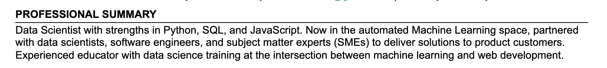
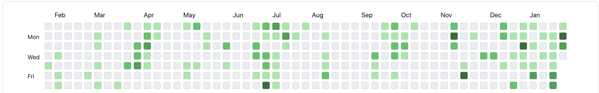
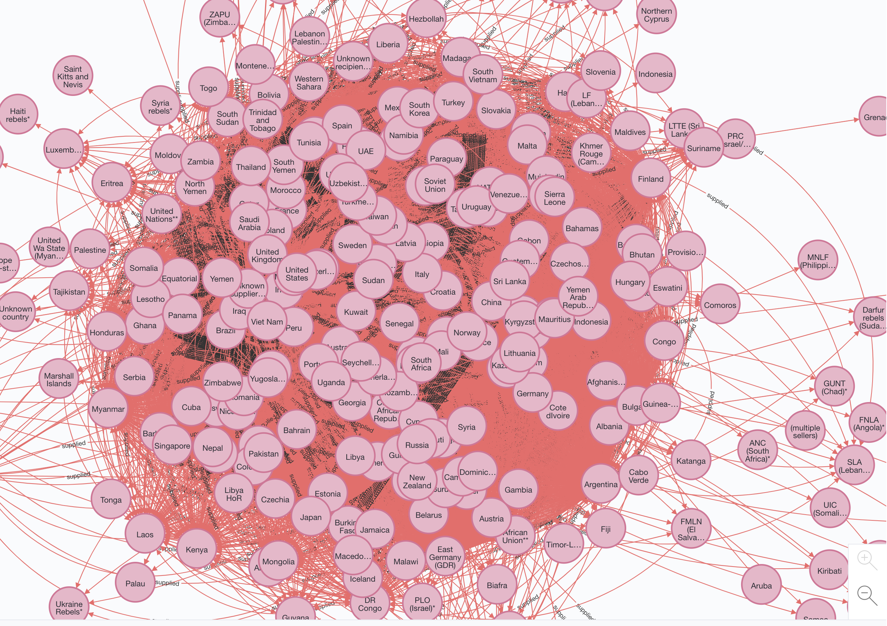
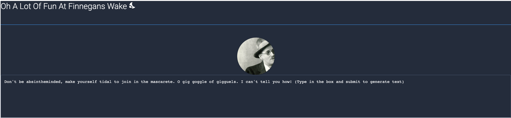
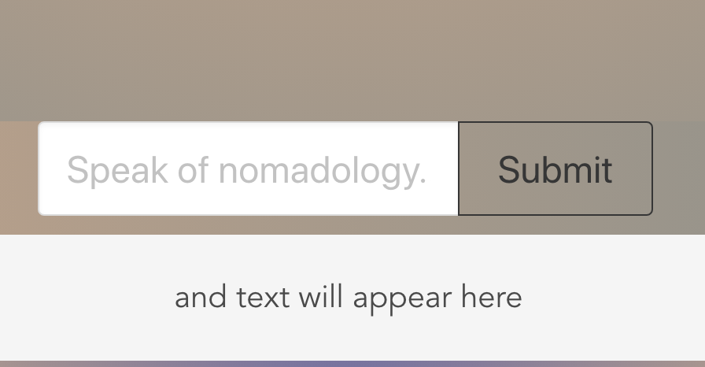
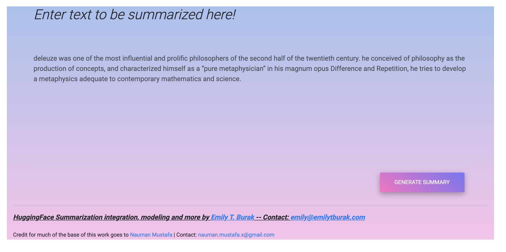
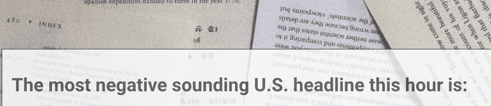
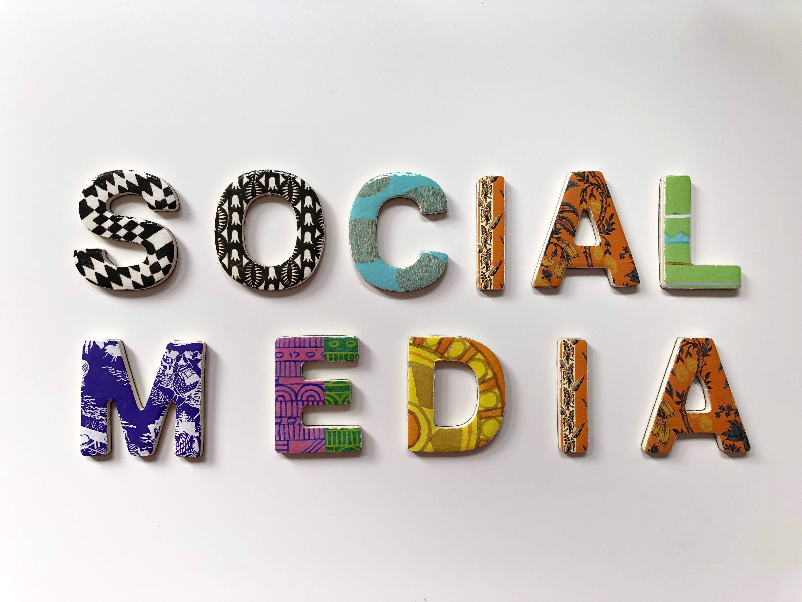
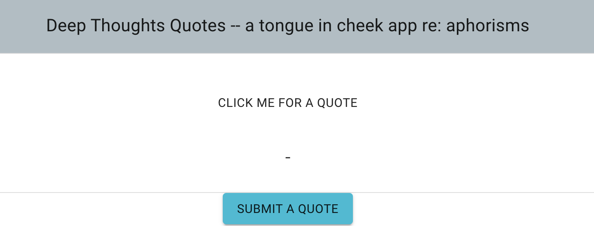

# **Emily T. Burak's Portfolio** _-- Data Engineer/Scientist and Software Developer in Colorado_

---

# **About me:**

_Data Scientist trained in Full Stack Web Development specializing in JavaScript, Python, and SQL._ Computer Science educator towards diversity in STEM, comfortable working at the intersection of technology with business and finance, politics, wherever life takes me.

Why do I do it and how do I do it?

Same answer: _I live out a love for tech, most of all collaborating to solve complex challenges and making an impact on the world._

---

## More information about me can be found at

- [LinkedIn](https://www.linkedin.com/in/michael-burak/)

- [My Resume](https://docs.google.com/document/d/1GM-2y2pKSyvS0RD0umWTW-D-1mJSTeuM3DI1SMKzAbM/edit?usp=sharing)

- Github, [right here!](https://github.com/MichaelBurak)

---

# **Projects**

## Current Projects:

### _Lords of War: An Arms Trade Analysis_

- Work in progress Python-based data analysis of historical global arms trade data from [SIPRI](https://www.sipri.org/databases/armstransfers) using Neo4j as a graph database for tricky heavily relationship-driven rich text format data focusing on supply dynamics. Utilizing clustering with t-SNE/UMAP, outlier detection, and NLP on comments on the trades. Future work includes adding more synergistic data and machine learning modeling with a focus on the Cold War. [(Repo)](https://github.com/MichaelBurak/arms-trade-analysis)
  [(Interactive graph viz -- takes a minute to load, mostly just pretty)](https://arms-trade-connections-viz.netlify.app/)

---

### _WakeNight & Nomadologic Generator_

- Work using [GPT-2 simple](https://github.com/minimaxir/gpt-2-simple) to generate text off user prompts from Finnegans Wake and A Thousand Plateaus, linguistically dense texts, with a front end, dockerized and hosted on Google Cloud services.[(Nomadologic's Website)](https://nomadologic-generator.netlify.app/)
  [(Latent Dirichlet Allocation Topic Modeling on A Thousand Plateaus)](https://nomad-lda.herokuapp.com/)

---

### _The Defense Sector and Authoritarian Regime Changes - A Stock Analysis:_

- Capstone project utilizing Python time series analysis techniques for prediction of Lockheed Martin stock using regime change/state stability data for Flatiron School's Data Science program. [(README)](https://defense-sector-authoritarianism.netlify.app/)

---

### _Text Summarizer That Lacks A Clever Name:_

- A text summary generator utilizing [Hugging Face](https://huggingface.co/)'s implementation of the T5 transformer applied to user-submitted text.

[(Website)](https://summary-docker-demo-7cgts76p3a-uw.a.run.app/)

---

## Past/Not Currently Being Worked On Projects:

### _Got Some Bad News(?)_

- _An instant doomscroller using Natural Language Processing Machine Learning in Python_

- Tired of looking through social media for the worst headline? Let text sentiment analysis and this site fetch you the most gloomy sounding thing going down. In Vue.js with a Flask backend in Python connected to MongoDB. [(Website)](https://badnewsdoomscroller.netlify.app/)

---

### _"Tells” in Tweets: Developing a reliable Twitter sentiment analysis classifier for tech companies_

_An Natural Language Processing analysis using Bayesian modeling on imbalanced twitter data_

- Project utilizing NLP techniques to examine tweets about Apple and Google during SXSW 2011 for Flatiron School's Data Science program.
  [(README)](https://tells-in-tweets.netlify.app/)

---

### _What's Good?_

- _A Gratitude App in Vue.js_

- Keep track of what you are grateful for with this app inspired by gratitude journaling. Includes CSS styling using Vuetify. [(Website)](https://whatsgoodgratitude.netlify.app/)

---

### _Deep Thoughts(2: This Time It's Thoughtful)_

- _A simple quote generator in React and Flask_

- Originally the tongue in cheek final project using React and Ruby on Rails I completed for Flatiron's Full Stack Software Engineering program, this is under revision/paused to utilize new technology and features such as React Hooks created after the first version along with a lightweight Flask + MongoDB backend. [(Website)](https://deep-thoughts2-flask.herokuapp.com/)

---

# **Reminder: Follow Me On**

[LinkedIn, click it, you got this far!](https://www.linkedin.com/in/michael-burak/)
